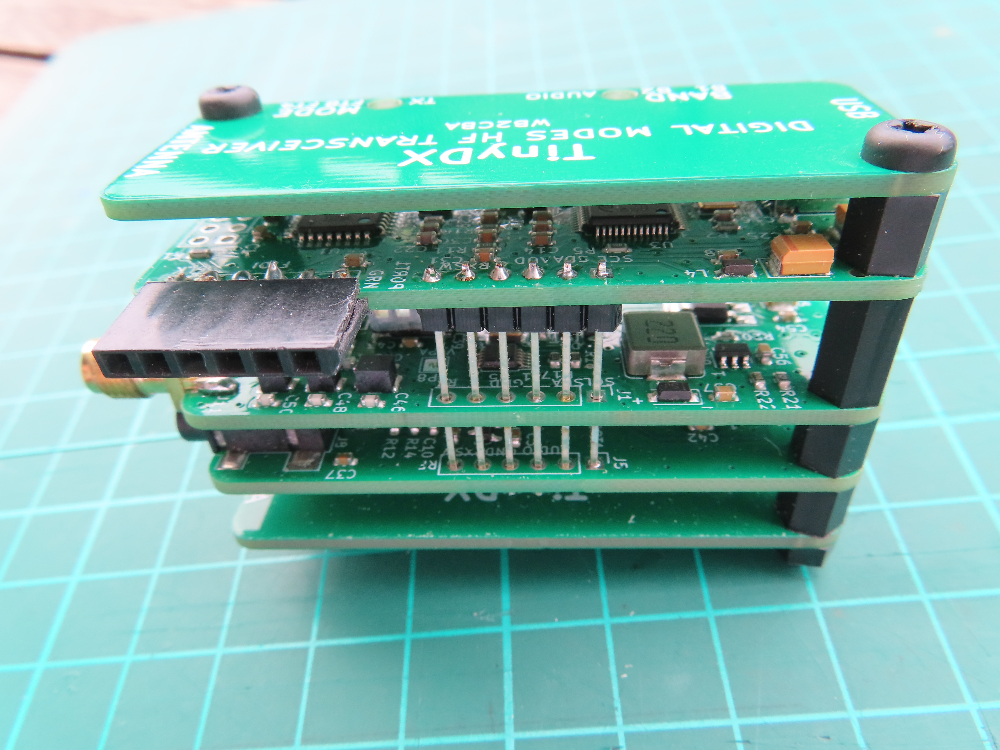

# TinyDX — Build Guide

> **Status: skeleton — photos and hardware-verified steps needed.**
> Sections marked `<!-- TODO: photo -->` need a contributed photograph.
> Sections marked `<!-- TODO: verify -->` need confirmation from a successful build.
> If you have built a TinyDX, please open an issue or PR with photos and corrections.

---

## ⚠️ Known PCB Issues — Read Before Ordering

The current fabrication files contain confirmed errors. Building without corrections
will produce boards that require manual rework:

| Issue | Board | Description | Status |
|-------|-------|-------------|--------|
| [#7](https://github.com/WB2CBA/TinyDX---Tiny-Digital-Modes-HF-Transceiver/issues/7) | Main | Switch footprints in wrong orientation for JLCPCB pick-and-place | Community PR #14 open |
| [#10](https://github.com/WB2CBA/TinyDX---Tiny-Digital-Modes-HF-Transceiver/issues/10) | Main | R8 and R9 transposed in schematic and BOM | Not yet fixed |
| [#11](https://github.com/WB2CBA/TinyDX---Tiny-Digital-Modes-HF-Transceiver/issues/11) | TX | Component placement wrong for JLCPCB pick-and-place | Community PR #16 open |

**Recommendation:** wait until PRs #7, #14, and #16 are merged and a community member
has confirmed a successful build from the corrected files before ordering.

---

## Overview

TinyDX is a modular stack of five PCBs sandwiched between two protective cover plates,
connected by 2×6 pin headers on each side. Assembled dimensions: 50 × 25 × 30 mm.

Stack order (top to bottom):

```
┌─────────────────────────┐
│     Top Cover Plate     │
├─────────────────────────┤
│  Main Controller Board  │  (CM108B audio codec + ATmega328P + switches)
├─────────────────────────┤
│    Transmitter Board    │  (SI5351 PLL VCO + 74ACT244 RF PA + LPF)
├─────────────────────────┤
│     Receiver Board      │  (TX/RX switch + 74ACT74 divider + QSD)
├─────────────────────────┤
│    Bottom Cover Plate   │
└─────────────────────────┘
```

<!-- TODO: photo — assembled stack from the side showing all five layers -->


---

## What You Will Need

### Tools

- Soldering iron (fine tip recommended for through-hole work near SMD components)
- Solder (0.6–0.8 mm, 60/40 or lead-free)
- Flush cutters for trimming leads
- Multimeter for continuity checks
- Arduino Uno (or compatible board) for ISP bootloader programming
- USB-to-TTL FTDI adapter (3.3V or 5V switchable) for firmware uploads — [example](https://a.co/d/g4zegI2)

### Hardware (fasteners)

- 8 × M3 spacers, 6 mm length
- 4 × M3 bolts
- 4 × M3 nuts

<!-- TODO: verify — confirm spacer length and bolt/nut size from a completed build -->

I I added a heatsink to the 74ACT244 thats why I replaced two of the spacers by 10mm versions.


### Through-hole Components to Source Separately

The following components are **not** included in the JLCPCB pick-and-place order and must
be sourced and hand-soldered:

| Component | Description | Fitted on |
|-----------|-------------|-----------|
| FTDI header | 6-pin 2.54 mm male header | Main board |
| Mini-Circuits T2-613-KK81+ | Bifilar RF transformer | TX board |
| SMA connector | Panel-mount or edge-mount, 50Ω | TX board |

Mini-Circuits T2-613-KK81+ datasheet and order link:
- Datasheet: https://www.minicircuits.com/pdfs/T2-613-1-KK81.pdf
- Order: https://www.minicircuits.com/WebStore/dashboard.html?model=T2-613-1-KK81%2B

---

## Step 1 — Order the PCBs from JLCPCB

TinyDX uses JLCPCB's SMT pick-and-place service for the three active boards.
The cover plates are bare PCBs (Gerber only).

Fabrication files are in `TinyDX Fabrication Files/`. See also:
`JLCPCB SMT ORDER PLACEMENT GUIDE.pdf` in the repository root for a step-by-step
ordering walkthrough from WB2CBA.

### 1.1 SMD boards (ordered with pick-and-place)

Each SMD board requires three files uploaded to JLCPCB:

| File type | Purpose | Example filename |
|-----------|---------|-----------------|
| Gerber (`.zip`) | PCB layout — upload as zip, do not extract | `GERBER TINY_LT_MAIN.zip` |
| BOM (`.csv`) | Bill of materials with JLCPCB part codes | `BOM TINY_M.csv` |
| CPL/position (`.csv`) | Pick-and-place component positions | `TINY_M-top-pos.csv` |

| Board | Gerber | BOM | CPL |
|-------|--------|-----|-----|
| Main Controller | `TinyDX Main FAB Files/GERBER TINY_LT_MAIN.zip` | `TinyDX Main FAB Files/BOM TINY_M.csv` | `TinyDX Main FAB Files/TINY_M-top-pos.csv` |
| Transmitter | `TinyDX TX FAB Files/GERBER TINY TX.zip` | `TinyDX TX FAB Files/BOM TINYDX TX.csv` | `TinyDX TX FAB Files/TINYDX TX-top-pos.csv` |
| Receiver | `TinyDX RX FAB Files/GERBER TINY RF.zip` | `TinyDX RX FAB Files/BOM TINY RF.csv` | `TinyDX RX FAB Files/TINY_RF-top-pos.csv` |

### 1.2 Cover plates (Gerber only, no pick-and-place)

Upload `TinyDX Fabrication Files/GERBER TINY DX COVER.zip` as a standard PCB order
(no SMT assembly). Order two copies — one for the top and one for the bottom.

<!-- TODO: verify — confirm whether two covers are identical or mirrored -->

---

## Step 2 — Inspect Received Boards

<!-- TODO: photo — top view of all five boards before assembly -->
<!-- TODO: photo — close-up of Main Controller board showing SMD components -->
<!-- TODO: photo — close-up of TX board showing Mini-Circuits transformer footprint -->

Before soldering, visually inspect each board:

- [ ] All SMD components present and correctly oriented
- [ ] No solder bridges between adjacent pads
- [ ] 2×6 pin headers present on both sides of each board
- [ ] Mounting holes clear of solder

<!-- TODO: verify — describe any common JLCPCB pick-and-place issues seen in practice -->

---

## Step 3 — Solder Through-hole Components

### 3.1 Main Controller Board — FTDI header

Fit the 6-pin 2.54 mm header to the FTDI pads on the Main board. The FTDI header
is used for all firmware uploads after the initial bootloader has been programmed.

<!-- TODO: photo — Main board with FTDI header fitted, showing pin orientation -->
<!-- TODO: verify — confirm pin 1 orientation from the silkscreen -->

### 3.2 TX Board — Mini-Circuits transformer and SMA connector

The Mini-Circuits T2-613-KK81+ transformer is the RF coupling transformer between
the 74ACT244 power amplifier and the low-pass filter. It is a manufactured bifilar
transformer connected as an auto-transformer.

<!-- TODO: photo — TX board showing transformer and SMA connector locations -->
<!-- TODO: verify — confirm transformer orientation (pin 1) from silkscreen or schematic -->

Fit and solder the SMA antenna connector to the antenna edge of the TX board.

<!-- TODO: photo — completed TX board with transformer and SMA soldered -->

---

## Step 4 — Bootloader Programming

The ATmega328P on the Main Controller board ships without a bootloader. The initial
bootloader must be programmed via the 2×3 ISP header using an Arduino board as ISP.
This is a one-time operation; all subsequent firmware uploads use the FTDI header.

### 4.1 First-time: upload Arduino Uno bootloader via ISP

Follow the standard Arduino ISP guide:
https://docs.arduino.cc/built-in-examples/arduino-isp/ArduinoISP/

Connect an Arduino Uno to the TinyDX Main board 2×3 ISP header:

| Arduino pin | ISP header pin |
|-------------|---------------|
| 10 (SS) | RESET |
| 11 (MOSI) | MOSI |
| 12 (MISO) | MISO |
| 13 (SCK) | SCK |
| 5V | VCC |
| GND | GND |

<!-- TODO: photo — Arduino connected to TinyDX ISP header -->
<!-- TODO: verify — confirm ISP header pin assignments from Main board silkscreen -->

In Arduino IDE: **Tools → Board → Arduino Uno → Burn Bootloader**.

Once the bootloader is uploaded, TinyDX appears as a standard Arduino Uno in the IDE.

### 4.2 Subsequent firmware uploads via FTDI

Connect a USB-to-TTL FTDI adapter to the Main board FTDI header. Open
`TinyDX_V1.4/TinyDX_V1.4.ino` in the Arduino IDE and upload as Arduino Uno.

> **Note:** TinyDX does not have an onboard USB-to-serial chip. The FTDI adapter
> provides the serial interface; the Arduino IDE handles the rest.

<!-- TODO: photo — FTDI adapter connected to Main board FTDI header -->

---

## Step 5 — Final Assembly

Stack the boards and cover plates in order (top to bottom):

1. Top Cover Plate
2. Main Controller Board
3. Transmitter Board
4. Receiver Board
5. Bottom Cover Plate

Thread M3 bolts through the corner holes, fit 6 mm spacers between each board,
and secure with nuts.

<!-- TODO: photo — boards in order before stacking, showing connector alignment -->
<!-- TODO: photo — assembled unit from the side showing spacers -->
<!-- TODO: photo — completed TinyDX next to a coin for size reference (as in the blog article) -->
<!-- TODO: verify — confirm spacer count and placement (inner spacers between boards, or only at corners?) -->

---

## Step 6 — Smoke Test

Before connecting an antenna or running RF, perform a basic power-on check:

- [ ] Connect TinyDX to a USB power source (phone, tablet, or PC)
- [ ] Confirm the device enumerates as *USB Audio Device*
- [ ] Confirm the device does not draw excessive current (expected: ≤ 100 mA on RX)
- [ ] Check that the Band and Mode slide switches move freely and actuate correctly

<!-- TODO: verify — describe expected LED or indicator behaviour on power-up, if any -->

---

## What's Next

- [SETUP.md](SETUP.md) — firmware upload procedure and configuration
- [OPERATING.md](OPERATING.md) — WSJT-X, IFTX, and TrailDigi setup
- [BOM.md](BOM.md) — full bill of materials in readable format
- [TECHNICAL_PAPER.md](TECHNICAL_PAPER.md) — system architecture and design details

---

*Build guide skeleton — contributed by the community. If you have built a TinyDX,
please open an issue or PR at
https://github.com/WB2CBA/TinyDX---Tiny-Digital-Modes-HF-Transceiver
with corrections, photos, and verification notes.*
